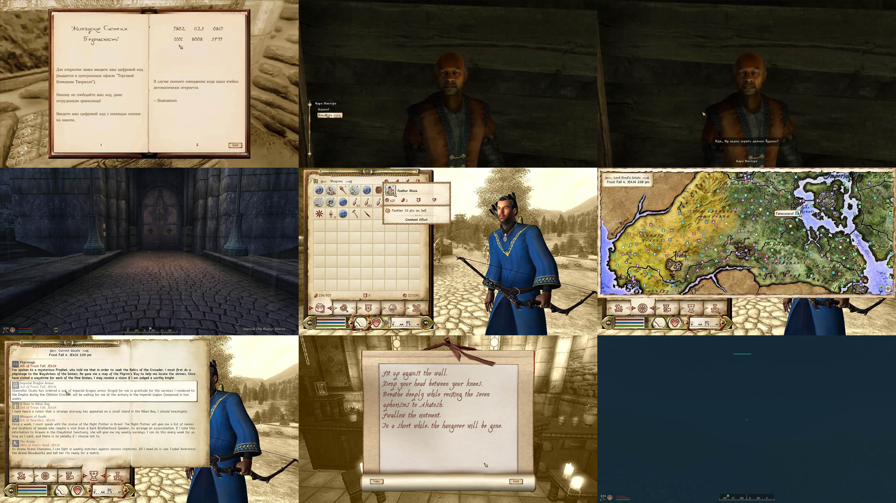

# Customized DarNified UI

Enhanced configurations and retextures for DarNified UI



## Changes

- Updated default settings
- Retextured icons, cursors, HUD, maps, books, and scrolls
- Added Cyrillic font support and capitalized initials

## Requirements

- [TES IV: Oblivion](https://store.steampowered.com/app/22330/The_Elder_Scrolls_IV_Oblivion_Game_of_the_Year_Edition/)
- [Oblivion Mod Manager](https://www.nexusmods.com/oblivion/mods/10763)
- A text editor (e.g., Notepad)

## Installation

1. Move `/obmm` to the game directory.
2. Open **Oblivion Mod Manager** and install **DarNified UI**:
   - Select **'All'**, then **'OK'**
   - Choose **'Colored Local Map'** → **'Normal'**
   - Confirm all prompts
3. Delete all fonts in `../Data/Fonts/`.
4. Copy `/data` from **Customized DarNified UI** to the game directory.
5. In **Oblivion Mod Manager**:
   - Go to **'Utilities'** → **'Archive Invalidation'**
   - Set **'BSA alteration'**, check **Textures, Fonts, Menus**
   - Click **'Update Now'**
6. Done! 😊 Proceed to **INI Configuration**.

## INI Configuration

Update `oblivion.ini` (default: `../My Documents/My Games/Oblivion/`):

```
[Fonts]
SFontFile_1=Data\Fonts\Cambria_16.fnt
SFontFile_2=Data\Fonts\Modernist_One_20.fnt
SFontFile_3=Data\Fonts\Kingthings_Petrock_Rus_16.fnt
SFontFile_4=Data\Fonts\daedric_font.fnt
SFontFile_5=Data\Fonts\handwritten.fnt
```

Enable an alternative enemy health bar:

```
[GamePlay]
bHealthBarShowing=1
```

## Tweaks for Performance & Visuals

```
[BackgroundLoad]
bBackgroundLoadLipFiles=1
bLoadBackgroundFaceGen=1
bSelectivePurgeUnusedOnFastTravel=1

[Controls]
bBackground Keyboard=1
bUse Joystick=0

[Display]
iShadowMapResolution=1024
bAllow30Shaders=1

[GamePlay]
bSaveOnInteriorExteriorSwitch=0

[General]
uExterior Cell Buffer=144
SMainMenuMovieIntro=
SMainMenuMovie=
SIntroSequence=
bUseThreadedBlood=1
bUseThreadedMorpher=1
bAllowScriptedAutosave=0
iPreloadSizeLimit=104857600
bUseHardDriveCache=1
bUseThreadedTempEffects=1
bUseThreadedParticleSystem=1

[Grass]
iMinGrassSize=120

[HAVOK]
iNumHavokThreads=5

[Interface]
fDlgFocus=3.0000

[OPENMP]
iThreads=9

[Pathfinding]
bBackgroundPathing=1
```

## Credits

- [DarN](https://www.nexusmods.com/oblivion/mods/10763) – Creator of DarNified UI
- [evercharmer](https://www.nexusmods.com/oblivion/mods/39702) – HUD bars
- [xythen](https://www.nexusmods.com/oblivion/mods/3002) – Colored map of Cyrodiil
- [odin_ml](https://www.nexusmods.com/oblivion/mods/16640) – Colored map of Shivering Isles
- [Xerus](https://www.nexusmods.com/oblivion/mods/32450) – Colored map icons
