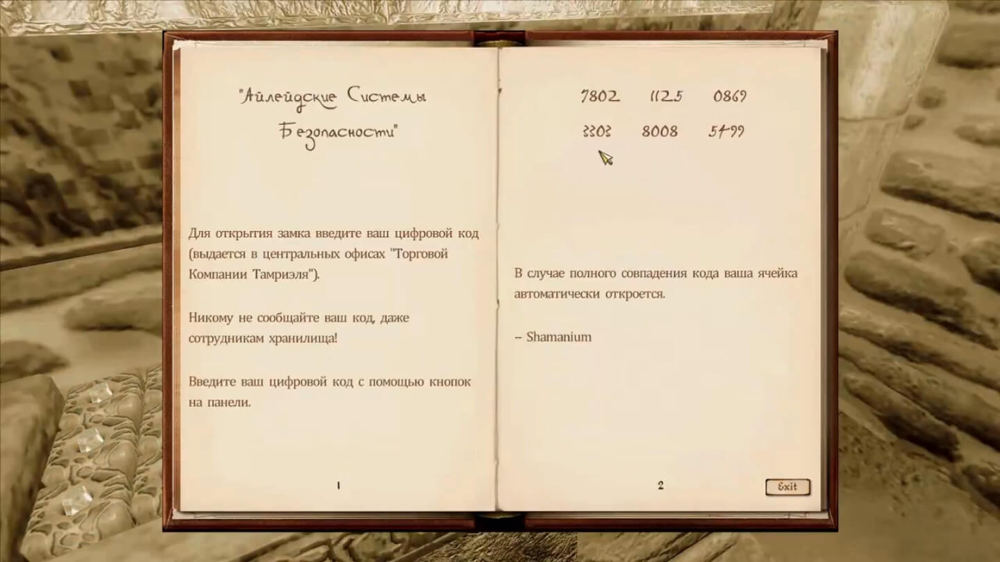
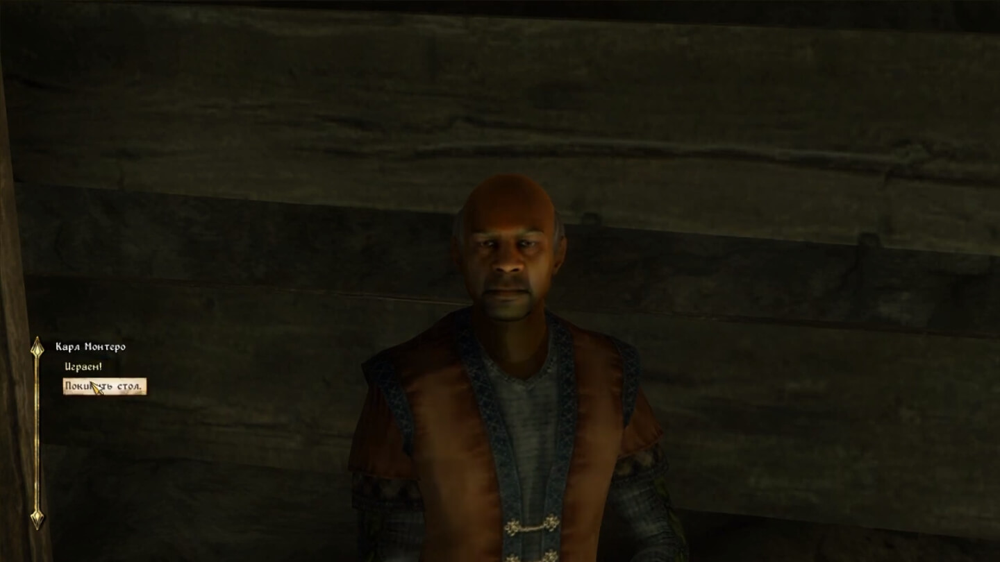
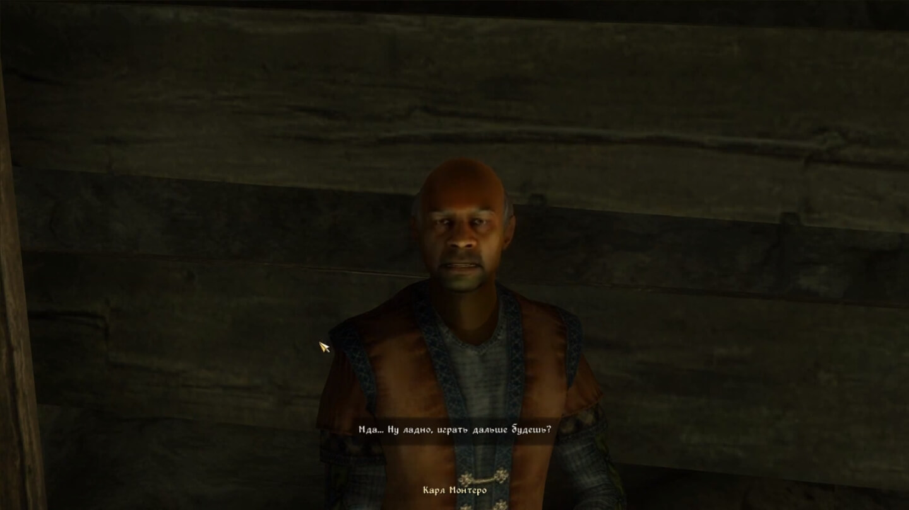
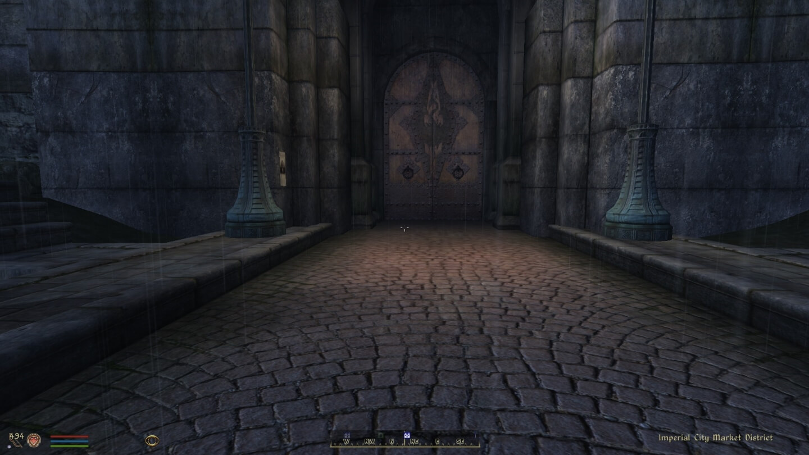
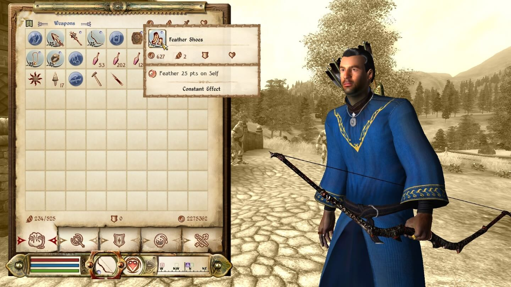
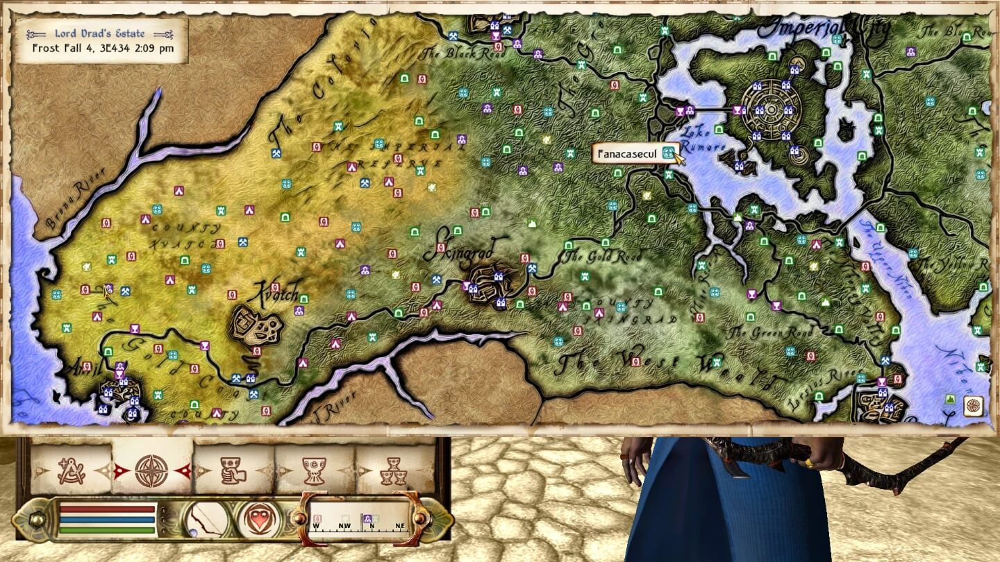
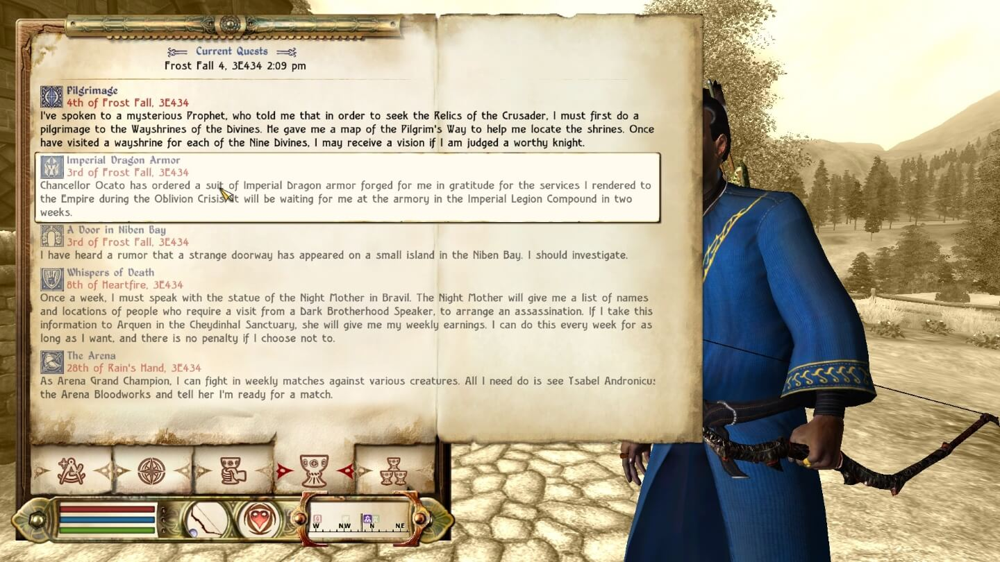
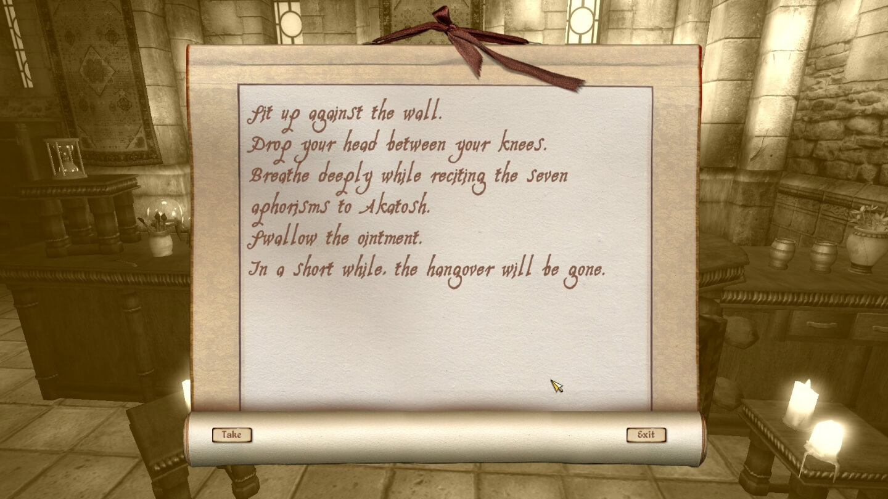
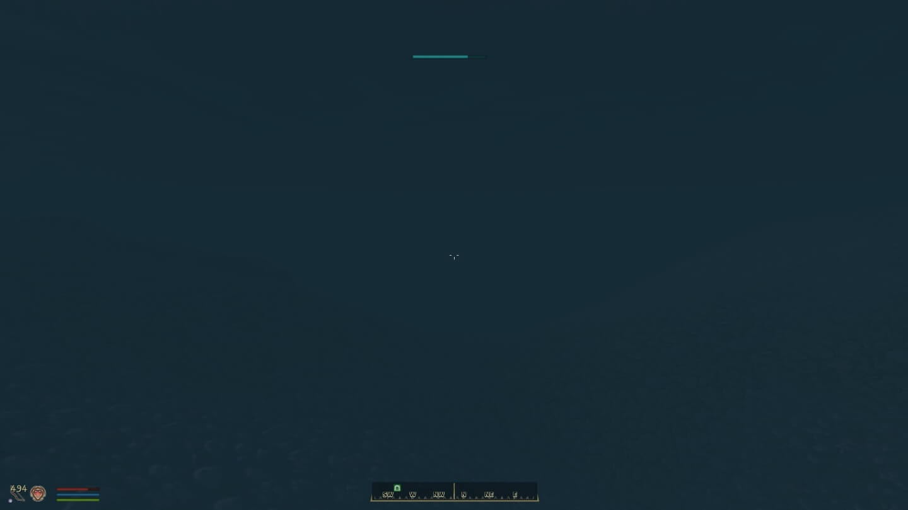

# Screenshots











# Description

These are **custom configs and retextures for DarNified UI**.

_About **DarNified UI** from the [source](https://www.nexusmods.com/oblivion/mods/10763 'Nexus Mods'):_

> This mod gives the Oblivion UI the most extensive facelift yet. It\'s goal is to rid the pc version of the horrid xbox interface. Fonts are smaller, settings can be adjusted in game, user controls are scaled, more info on screen, and the hud is vastly improved.

## What has been changed

- Default settings;
- All _activate icons_ textures;
- _Cursor_ texture;
- _HUD reticle_ texture;
- _Map_ textures;
- _Map icons_ texture;
- _HUD bars_ textures;
- _Compas frame_ texture;
- _Book_ and _scroll_ textures.

## What has been added

- Fonts with cyrillic symbols support;
- Initial capital letters for cyrillic texts.

# Required software

- [TES IV: Oblivion](https://store.steampowered.com/app/22330/The_Elder_Scrolls_IV_Oblivion_Game_of_the_Year_Edition/ 'Steam');
- [Oblivion mod manager](https://www.nexusmods.com/oblivion/mods/10763 'Nexus Mods');
- Text editor _(e.g. 'Microsoft Notepad')_.

# How to install

1. Move `/obmm` folder in game's directory;
2. Launch **Oblivion mod manager** and install **DarNified UI**:

- - Press **'Select Components'**;
- - Press **'All'**;
- - Press **'Ok'**;
- - Choose **'Colored Local Map'** only;
- - Choose **'Normal'**;
- - Answer **'Yes'** to all popus.

3. Open game's directory `../data/fonts/` and delete all fonts;
4. Copy `/data` folder from **custom configs and retextures for DarNified UI** to game's directory with replacement;
5. In **Oblivion mod manager**:

- - Press `Utilities`;
- - Select `Archieve invalidation`;
- - Switch radio button to `BSA alteration`;
- - Check: `Textures`, `Fonts`, `Menus`;
- - Press `Update Now`.

6. Well done! 😊 Time for **INI Configuration**.

# INI Configuration

For correct fonts displaying change default values for `[Fonts]` section in `oblivion.ini` file _(Default path: `../my documents/my games/oblivion/`)_:

```
[Fonts]
SFontFile_1=Data\Fonts\Cambria_16.fnt
sfontfile_2=Data\Fonts\Modernist_One_20.fnt
sfontfile_3=Data\Fonts\Kingthings_Petrock_Rus_16.fnt
sfontfile_4=Data\Fonts\daedric_font.fnt
SFontFile_5=Data\Fonts\handwritten.fnt
```

My configs disable default enemy's health bar. You need to enable another healthbar over enemy's head:

```
[GamePlay]
bHealthBarShowing=1
```

## Extra

I prefer to use _dialog focus_ value equal to `4.0000`.

```
[Interface]
fDlgFocus=4.0000
```

I use values below to improve game performance:

```
[BackgroundLoad]
bBackgroundLoadLipFiles=1
bLoadBackgroundFaceGen=1
bSelectivePurgeUnusedOnFastTravel=1

[Controls]
bBackground Keyboard=1
bUse Joystick=0

[Display]
iShadowMapResolution=1024
bAllow30Shaders=1

[GamePlay]
bSaveOnInteriorExteriorSwitch=0

[General]
uExterior Cell Buffer=144
SMainMenuMovieIntro=
SMainMenuMovie=
SIntroSequence=
bUseThreadedBlood=1
bUseThreadedMorpher=1
bAllowScriptedAutosave=0
iPreloadSizeLimit=104857600
bUseHardDriveCache=1
bUseThreadedTempEffects=1
bUseThreadedParticleSystem=1

[Grass]
iMinGrassSize=120

[HAVOK]
iNumHavokThreads=5

[OPENMP]
iThreads=9

[Pathfinding]
bBackgroundPathing=1
```

# Special thanks

- [DarN](https://www.nexusmods.com/oblivion/mods/10763 'Nexus Mods') - creator of **DarNified UI**;
- [evercharmer](https://www.nexusmods.com/oblivion/mods/39702 'Nexus Mods') - _HUD bars_;
- [xythen](https://www.nexusmods.com/oblivion/mods/3002 'Nexus Mods') - colored _map_ of Cyrodiil;
- [odin_ml](https://www.nexusmods.com/oblivion/mods/16640 'Nexus Mods') - colored _map_ of Shivering Isles;
- [Xerus](https://www.nexusmods.com/oblivion/mods/32450 'Nexus Mods') - colored _map icons_;
